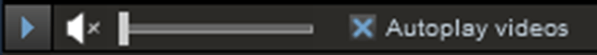
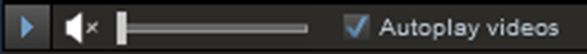
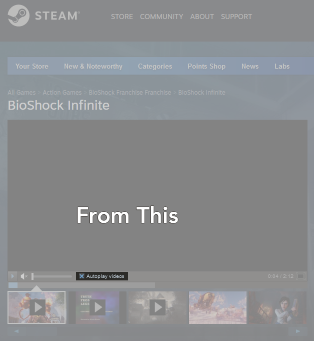
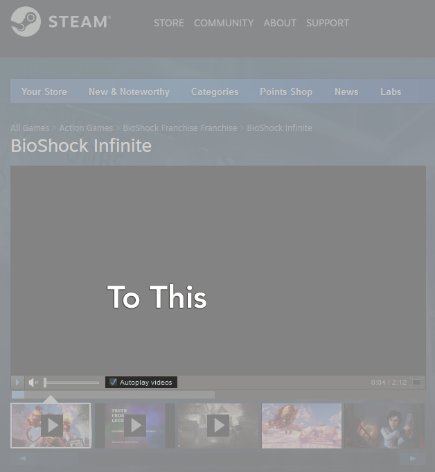
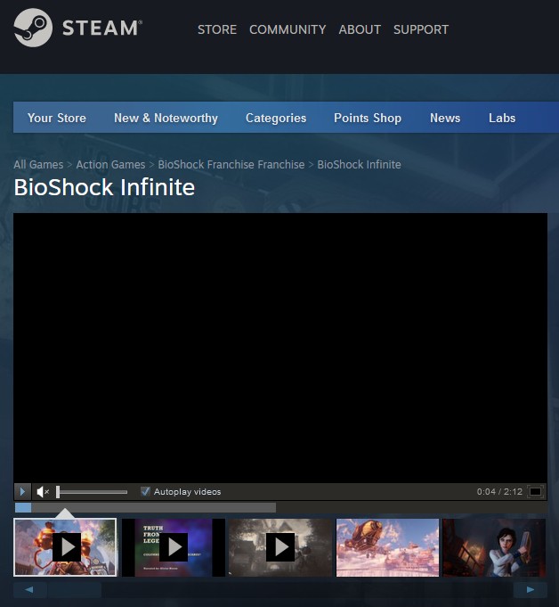

Steam Autoplay Button is Checkmark
==================================

***A Firefox Add-on***

---

Replace the cross in 'Autoplay videos' checkbox on Steam with a checkmark.

This player 
turns into this 

### What
Videos on Steam's Store section are played in Valve's video player. Well this player has its problems, and the smallest and the most annoying one is the "Autoplay videos" checkbox.

If you click on it, you see a cross. In a checkbox, a checkmark should be used instead of a cross. Period.

### Why
Cross implies negativity, so it can be confusing. Especially when Steam doesn't play the video even though the button is clicked. (*It happens occasionally.*)

### Screenshots

